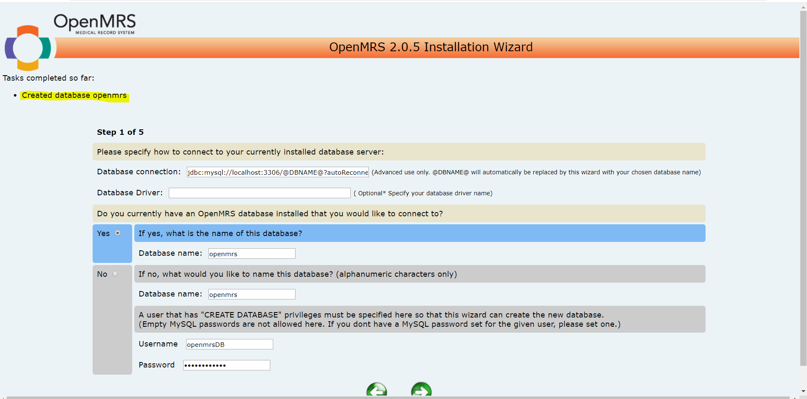

# Bhamani Application Deployment
### Manual Installation
  * Create an ubuntu instance (t2.large)
  * Login into the ubuntu instance become root user and install the following


```
  # Notes:
    # - This script installs OpenJDK8, MySQL 5.6, Tomcat8 to the default directories for Ubuntu 18.04 using PPAs
    # - Install locations:
    #   - OpenMRS Home Directory: /usr/share/tomcat8/.OpenMRS
    #   - Tomcat8 Webapps: /var/lib/tomcat8/webapps/
    #   - Tomcat8 Log: /var/log/tomcat8/catalina.out
    #   - Tomcat8 Environment Variables: /var/lib/tomcat8/bin/setenv.sh

    #!/bin/bash

    #Run apt-get update
    sudo apt-get update

    #Install openjdk-8 (java 8 development kit) by PPA
    echo "Installing OpenJDK8"
    sudo add-apt-repository ppa:openjdk-r/ppa -y
    sudo apt-get update
    sudo apt-get install -y openjdk-8-jdk

    #Install tomcat8
    echo "Installing Tomcat8, stopping the service, setting the JAVA_HOME location and setting the catalina env variables"
    sudo apt-get install -y tomcat8
    sudo service tomcat8 stop
    echo 'JAVA_HOME="/usr/lib/jvm/java-8-openjdk-amd64"' | sudo tee --append /etc/default/tomcat8
    echo 'CATALINA_OPTS="-Xms512m -Xmx1024m"' | sudo tee --append /usr/share/tomcat8/bin/setenv.sh

    #Install MySQL Server (You will be prompted for a root password during this step, which is required for )
    echo "Installing MySQL Server. You will be prompted for a password."
    sudo apt-get install -y mysql-server-5.6

    #Install curl to be able to get the .war files
    echo "Installing curl"
    sudo apt-get install -y curl

    #Download the .war file
    echo "Downloading the OpenMRS Platform v2.0.5 .war file"
    curl -O -L -J "https://sourceforge.net/projects/openmrs/files/releases/OpenMRS_Platform_2.0.5/openmrs.war/download"
    sudo cp openmrs.war /var/lib/tomcat8/webapps/openmrs.war

    #Install unzip to unzip the modules
    echo "Installing unzip"
    sudo apt-get install -y unzip

    #Download the OpenMRS 2.6.1 modules
    echo "Downloading the OpenMRS 2.6.1 modules"
    curl -O -L -J "https://sourceforge.net/projects/openmrs/files/releases/OpenMRS_Reference_Application_2.6.1/referenceapplication-modules-2.6.1.zip/download"
    unzip referenceapplication-modules-2.6.1.zip

    #Make a .OpenMRS home directory in /usr/share/tomcat8/ and copy modules to that folder
    echo "Creating OpenMRS directory in /usr/share/tomcat8/.OpenMRS and setting tomcat8 permissions to all tomcat directories"
    sudo mkdir /usr/share/tomcat8/.OpenMRS
    sudo mkdir /usr/share/tomcat8/.OpenMRS/modules
    sudo mv referenceapplication-package-2.6.1/*.omod /usr/share/tomcat8/.OpenMRS/modules/
    sudo chown -R tomcat8:tomcat8 /usr/share/tomcat8
    sudo chown -R tomcat8:tomcat8 /var/lib/tomcat8

    #Start tomcat and navigate to http://localhost:8080/openmrs to complete setup
    echo "Starting Tomcat"
    sudo service tomcat8 start
    echo "Navigate to http://localhost:8080/openmrs to continue the OpenMRS setup process"

    #install mysql-client and connect the instance to RDS
    sudo apt-get install mysql-client -y 
    mysql -u -h -p 
```

## after successful instlation Access the Application using
   
  * http://localhost:8080/openmrs

## By using above installation steps build a packer image 

   * write template for packer 
   * write yaml file for software instlation 

 exucute 

```
    packer build template1.json    
```
## write terraform template for following 

    * write terraform file for Autoscaling group 
    * write terraform file for loadbalancer  
    * write terraform file for RDS

 exucute 
```
terraform apply .
```
 * after successful creation goto endpont of loadbalancer and access 
    http://elb-tf-745865978.us-west-2.elb.amazonaws.com:8080/openmrs/initialsetup

then after create database for openMRS


